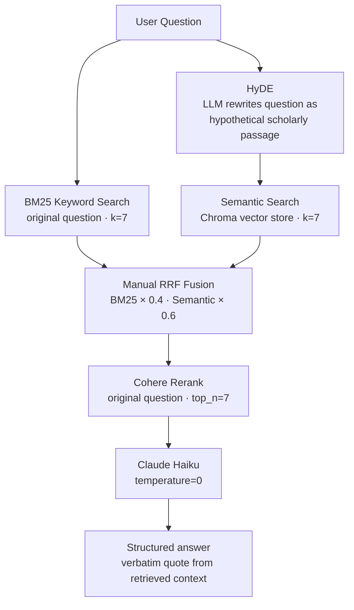

# Shakespeare-GPT
grounded, cited answers to questions about Shakespeare's plays

Large language models know a lot about Shakespeare. I'm someone who has always been drawn to theatre, going to shakespeare in the park in NYC every summer since 6th grade. Being a data science major and with working experience at start-ups, I came up with this project idea in 2024 as away to combine these two interests of mine to solve a common LLM problem, misquoting. 

I have continued to work on this project for over a year, iterating on it as I hav learned more about RAG and Agent pipelines through coursework, alternative side projects and books. ShakespeareGPT-v2 takes my original naive RAG setup and includes hybrid search, reranking, and evaluation metrics.

The problem with asking a plain LLM about Shakespeare is that it will answer confidently whether or not it actually knows. Models frequently produce quotes that sound Elizabethan but do not appear in the play, cite the wrong act and scene, or conflate plot details across works. There is no signal when this happens.

From this, we can say a better solution would have three properties:

- every answer is grounded in retrieved passages from the actual plays.
- every quote is copied verbatim from a retrieved chunk, not recalled from memory.
- every citation (Act X, Scene Y) is taken from the metadata of that same chunk.

Enter shakespeare-gpt: a RAG pipeline over all of Shakespeare's plays that retrieves the relevant scenes before generating an answer, and forces the model to quote directly from what was retrieved.

## Usage

Ask a question about any of Shakespeare's plays at [shakespearegpt.click](https://shakespearegpt.click).

Every answer follows the same four-section structure:

```
## Context
The broader situation in the play relevant to the question.

## Specific Moment
The exact dramatic moment that answers the question.

## Quote Specifically
"A verbatim passage from the retrieved text" (Act X, Scene Y)

## Analyse the Moment
How the quote supports the answer.
```

For example, asking *"How does Lady Macbeth persuade Macbeth to kill King Duncan?"* returns:

```
## Context
In Macbeth, after the witches prophesy that Macbeth will become king, he and Lady Macbeth
plot to murder King Duncan during his visit to their castle...

## Specific Moment
In Act I, Scene VII, Macbeth wavers on the plan and declares he will proceed no further.
Lady Macbeth responds by attacking his masculinity and framing hesitation as cowardice...

## Quote Specifically
"Was the hope drunk Wherein you dressd yourself? hath it slept since?
And wakes it now, to look so green and pale At what it did so freely?" (Act I, Scene VII)

## Analyse the Moment
Lady Macbeth does not appeal to ambition or reason — she dismantles Macbeth's sense of
himself as a man. By equating hesitation with weakness, she removes the psychological
space for him to refuse...
```

The sources panel shows the retrieved chunks the answer was drawn from, with play, act, and scene for each.

## Pipeline

Retrieval happens in three stages before the LLM sees anything.



**BM25** handles exact keyword matching — good for character names, specific phrases, and factual lookups. It always receives the original question.

**Semantic search** uses [HyDE](https://arxiv.org/abs/2212.10496): the question is first rewritten into a hypothetical scholarly passage by the LLM, and *that passage* is embedded and used for vector search. This closes the gap between a short question and the longer, Elizabethan-register text of the plays.

**Cohere rerank** re-scores the fused candidate set against the original question, ensuring the final context is the most relevant k=7 chunks regardless of how they were retrieved.

The vector store is [Chroma Cloud](https://trychroma.com), holding 4,560 chunks across all 37 of Shakespeare's plays. Embeddings use OpenAI `text-embedding-3-small`.

## Evals

The system is evaluated on 52 questions drawn from SparkNotes across six plays: Othello, Hamlet, Macbeth, Romeo and Juliet, A Midsummer Night's Dream, and Julius Caesar.

Three metrics are measured per question:

| Metric | Description |
|---|---|
| `format_ok` | All four required `##` sections present in the correct order |
| `citation_ok` | First six words of the quoted passage found verbatim in a retrieved source chunk |
| `judge_score` | Claude Haiku grades the answer 1–5 against a SparkNotes reference answer |

Current results:

| Metric | Score |
|---|---|
| Format compliance | 100% |
| Citation accuracy | 75% |
| Judge score | 4.00 / 5 |

Run the eval suite:

```bash
# Preflight checks
python evals/preflight.py --url https://shakespeare-gpt-v2-production-3c45.up.railway.app

# Full eval
python evals/run_eval.py \
  --url https://shakespeare-gpt-v2-production-3c45.up.railway.app \
  --save-to-db
```

## Stack

| Layer | Technology |
|---|---|
| Frontend | Next.js, deployed on Vercel |
| Backend | FastAPI, deployed on Railway |
| Vector store | Chroma Cloud |
| Embeddings | OpenAI `text-embedding-3-small` |
| LLM | Claude Haiku 4-5 via OpenRouter |
| Reranker | Cohere `rerank-v3.5` |
| Database | Railway Postgres (query logs, eval results) |

## Running locally

```bash
# Clone and install
git clone https://github.com/philipaidanbooth/Shakespeare-GPT-v2
cd Shakespeare-GPT-v2
python -m venv venv && source venv/bin/activate
pip install -r requirements.txt

# Set env vars
cp .env.example .env
# Fill in: OPENROUTER_API_KEY, OPENAI_API_KEY, COHERE_API_KEY,
#          CHROMA_TENANT_ID, CHROMA_DB_NAME, CHROMA_API_KEY, DATABASE_URL

# Start backend
uvicorn main:app --reload

# Start frontend
cd frontend && npm install && npm run dev
```

## Acknowledgments

I built this because every Shakespeare tool I found either gave you a search box over the raw text — useful but hard to interpret — or asked a plain LLM that would confidently invent lines Shakespeare never wrote. I wanted something that combined the grounding of retrieval with the fluency of generation, and was honest enough to say *"no suitable quote found"* rather than make one up.

## License

MIT
